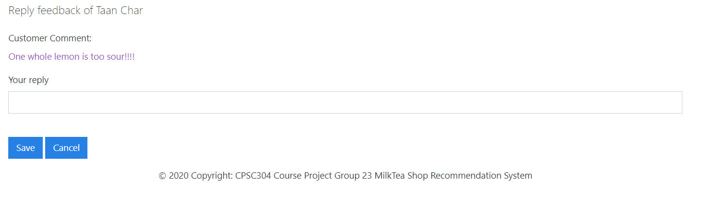

# CPSC304 Group Project - Implementation of a Relational Database

Milk Tea Shop Recommendation Platform
PHP + Mysql

## Project Group No.23
Xiaojun Tian 11240587

Jiefei Li 59322511

## Repository Content
### All Source Codes
### A SQL script to create the basic database
Note the application may fail if the database is not populated with preset data in the script.

## Running Environment
XAMPP with PHP and MySQL, tested with PHP 7.47 and Windows. 
Caution! code may not run on a Mac without proper configuration!

## Pages
To start this web application start from visiting "index.php".
### Main page

Registered user can sign in, new users can register and anonymous visitors can browse.

### User register page

New users can select which user type they want to register under user register page.

### User sign in page

Users can select sign in as customer or milk tea shop owner

### Customer main page

Customer can see general information of all the milk tea shop; filter milk tea shop by location, price level, rating level and drink
type; search shop by keywords; check the notification from milk tea shop;check which shop favoured by all the customer and shop information with maximum or minimun average rating value.

### Milk tea shop main page

Customer can see the milk tea shop details which are: open hours, sale event, drinks and other customer comments. Also they can like or dislike this shop and leave their own comments and rating under this page.

### Customer profile main page

Customer can change their general profile like name, email, password, etc. Also, they can update and delete itme from their shop like list and comment list.

### Owner Account Main Page

On this page, owners can check their account profile, store information, received comments;check statistic information about his or her stores; perform other operations related with their stores here.

### Owner Add Store Page

On this page, owners can add their stores through filling in a set of information about their stores.
### Owner Add/Edit Reply Page

On this page, owners can reply all the comments they have received and edit the replies they made before.
### Ower Edit Profile Page

On this page, owners can edit their account information and password.

### Owner Shop Management Page

On this page, owners can review the information about that stores, manage the drinks selling in that store, and review received comments about that store.

### Owner Add/Edit Drink Page

On this page, owners can add a drink to a specific store through filling a table. If the drink has already existed in the database, than the existing information overwrites user input. It applies to the situation that for a chainstore, drinks are ususally identitical, so no need to add one drink many times. Owners can also use this page to edit information of a specific drink, in edit mode, the drink name is not editable.

### Owner Add/Edit Event Page

On this page, owners can add a sales event to a specific store through filling a table. This page can also be used to edit event information, but in edit mode, the event name is not editable.

### Owner Edit Shop Information Page

On this page, owners can edit the shop information they have provided before.

### Owner Edit Shop Businesstime Page

On this page, owners can edit the business time of a specific on a certain day in a week.

### Note about Zip Code
For now, the first shop owner user who ever provides a Zip Code can decide which region this Zip Code corresponds to. Future users' input at creating store page or editing store page won't change the correspondence between an existent zip code and region. For future work, we will ask user to provide Zip Code only and let the application decide the matching region.
